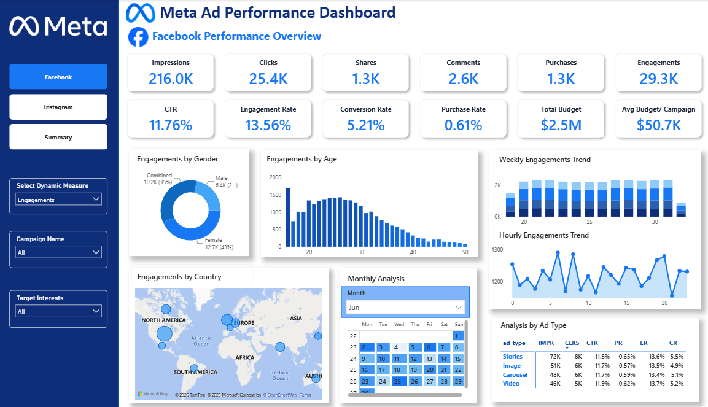
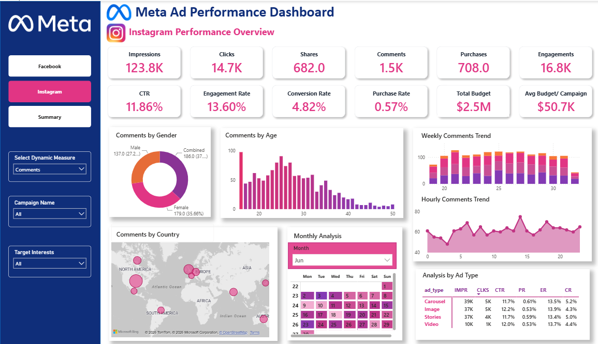
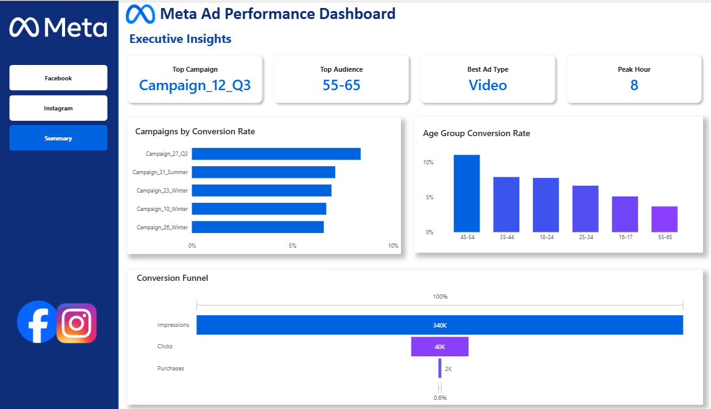

📊 Meta Ad Performance Dashboard

An interactive Power BI dashboard developed to analyze and compare Facebook and Instagram advertising campaigns. The dashboard provides insights into campaign performance, audience engagement, conversions, and advertising effectiveness through interactive visualizations and data-driven storytelling.

---

📸 Dashboard Preview

📘 Facebook Dashboard

  

📌 Key KPIs

- Total Impressions
- Total Reach
- Total Clicks
- Total Spend
- CTR (Click-Through Rate)
- CPC (Cost Per Click)
- Conversion Rate
- ROI

📊 Dashboard Highlights

- Campaign Performance Analysis
- Audience Engagement Analysis
- Geographic Performance Analysis
- Weekly, Monthly & Hourly Engagement Trends
- Ad Type Performance
- Interactive Filters & Slicers

---

📷 Instagram Dashboard

  

The Instagram dashboard provides the same KPIs and analyses as the Facebook dashboard, enabling easy comparison of advertising performance across both platforms.

---

📈 Executive Summary

  

📌 Executive KPIs

- Top Campaign
- Top Audience
- Best Ad Type

📊 Executive Visualizations

- Campaigns by Conversion Rate
- Age Group Conversion Rate
- Conversion Funnel

---

🎯 Business Questions Answered

- Which campaign performs the best?
- Which audience segment generates the highest engagement?
- Which ad type delivers the best results?
- Which age group has the highest conversion rate?
- How do Facebook and Instagram campaign performances compare?
- Which countries contribute the highest engagement?
- What does the customer conversion journey look like from impressions to purchases?

---

✨ Key Features

- Interactive Power BI Dashboard
- Dynamic Measure Selector
- Campaign Filters
- Target Interest Filters
- Cross-filtering Across Visuals
- Custom Tooltips
- Geographic Analysis
- Conversion Funnel Visualization
- Executive Summary Dashboard
- Interactive Slicers

---

🛠️ Tools & Technologies

- Microsoft Power BI
- Power Query
- DAX (Data Analysis Expressions)
- Data Modeling
- Interactive Visualizations

---

📂 Repository Structure

Meta-Ad-Performance-Dashboard
│
├── dashboard.pbix
├── dataset.csv
├── README.md
└── images
    ├── Facebook_dashboard.png
    ├── Instagram_dashboard.png
    └── Executive_summary.png

---

🚀 How to Use

1. Clone or download this repository.
2. Open Dashboard.pbix using Microsoft Power BI Desktop.
3. Explore the Facebook Dashboard, Instagram Dashboard, and Executive Summary pages.
4. Use the interactive filters and slicers to analyze campaign performance.

---

⭐ Project Highlights

- Developed a multi-page interactive Power BI dashboard for Meta advertising campaign analysis.
- Performed data transformation and cleaning using Power Query.
- Created DAX measures for KPI calculations and dynamic business insights.
- Designed an executive summary to present high-level campaign performance.
- Implemented custom tooltips, slicers, and cross-filtering for enhanced user interaction.

---

📌 Repository Structure

Meta-Ad-Performance-Dashboard
│
├── Dashboard.pbix
├── Dataset.csv
├── README.md
└── Images
    ├── Facebook_dashboard.png
    ├── Instagram_dashboard.png
    └── Executive_summary.png

---

⭐ This project demonstrates how Power BI transforms Meta advertising data into actionable business insights through KPI tracking, interactive dashboards, and data-driven storytelling.
